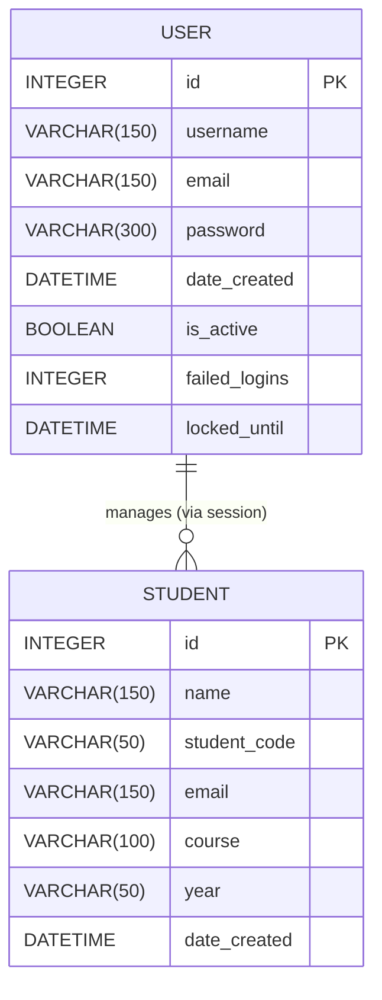
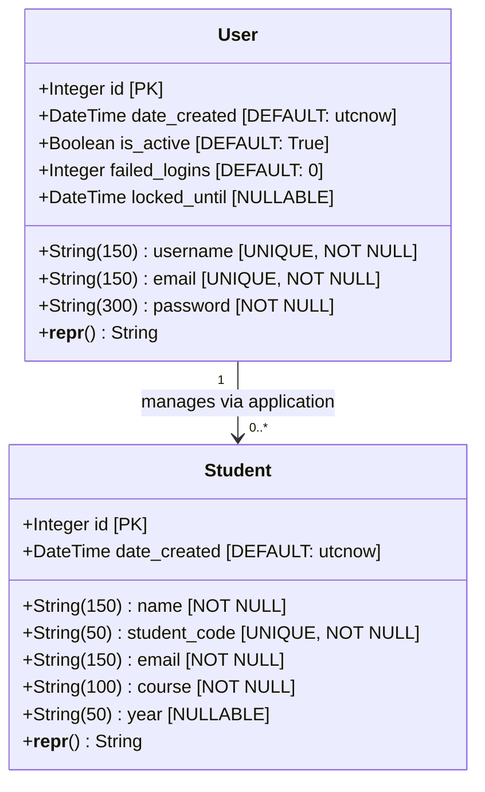
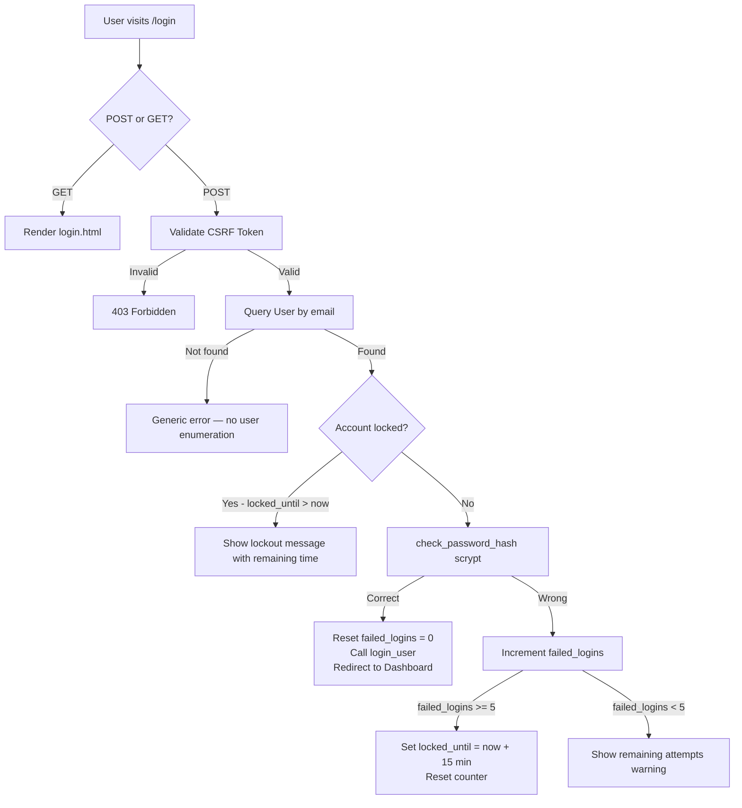

# 📘 Technical Guide — Student Management System
**Helwan International Technological University — HCI & Cybersecurity Project**
**Author: Omar Kapil (عمر قابيل) | Role: Database Engineer 🗄️**

---

## 📋 Table of Contents

1. [Executive Summary](#executive-summary)
2. [Technology Stack](#technology-stack)
3. [Project Structure](#project-structure)
4. [Code Analysis — File by File](#code-analysis)
   - [backend/app.py](#backendapppy)
   - [backend/models/\_\_init\_\_.py](#backendmodelsinitpy)
   - [backend/routes/students.py](#backendroutesstudentspy)
   - [backend/routes/dashboard.py](#backendroutesdashboardpy)
   - [backend/routes/auth.py](#backendroutesauthpy)
   - [backend/routes/users.py](#backendroutesuserspy)
   - [backend/templates/](#backendtemplates)
   - [backend/static/css/style.css](#backendstaticcss)
   - [.env.example](#envexample)
   - [requirements.txt](#requirementstxt)
   - [run.bat / run.sh](#runbat--runsh)
5. [Database Visualization](#database-visualization)
   - [Entity Relationship Diagram (ERD)](#entity-relationship-diagram)
   - [Database Schema Diagram](#database-schema-diagram)
6. [Security Architecture](#security-architecture)
7. [HCI Principles Applied](#hci-principles-applied)

---

## Executive Summary

### My Role — Omar Kapil (Michelangelo 🍕)

According to `TEAM_ROLES.md`, I was assigned the **Database** role in this project. My responsibilities covered:

- Designing the complete **Entity Relationship Diagram (ERD)**
- Implementing the `User` and `Student` SQLite database models via **Flask-SQLAlchemy**
- Building the **CRUD operations** for student records (`routes/students.py`)
- Writing the **dashboard statistics** queries (`routes/dashboard.py`)
- Applying **parameterised queries** through the SQLAlchemy ORM to prevent SQL Injection
- Setting up the **database initialisation** and migration logic in `app.py`
- Configuring the **environment template** (`.env.example`) and `requirements.txt`

### Project Core Purpose

The **Student Management System** is a secure, web-based application built for **Helwan International Technological University** as part of the HCI & Cybersecurity curriculum. It allows authorised staff to:

- **Manage student records** — Add, View, Edit, Delete (full CRUD)
- **Search students** by Name, Student Code, Course, or Year with date-range filtering
- **Export data** to CSV format
- **Manage system users** (admin accounts)
- **View dashboard statistics** — total enrolments and recent additions

The system is built on **Python Flask**, backed by **SQLite** via **Flask-SQLAlchemy**, secured with **Flask-WTF CSRF protection**, password hashing (`scrypt`), and brute-force login lockout. The UI follows HCI design principles using **Bootstrap 5** and **Font Awesome 6**.

---

## Technology Stack

| Layer      | Technology           | Version  | Purpose                        |
|------------|----------------------|----------|--------------------------------|
| Backend    | Python / Flask       | 3.x      | Web server & routing           |
| ORM        | Flask-SQLAlchemy     | 3.1+     | Database abstraction layer     |
| Database   | SQLite               | built-in | Persistent data storage        |
| Auth       | Flask-Login          | 0.6.x    | Session & user authentication  |
| Security   | Flask-WTF (CSRF)     | 1.2+     | Cross-Site Request Forgery protection |
| Security   | Werkzeug (scrypt)    | 3.0+     | Password hashing               |
| Frontend   | Bootstrap 5          | 5.1.3    | Responsive UI framework        |
| Icons      | Font Awesome         | 6.0      | UI icon library                |
| Templating | Jinja2               | built-in | Server-side HTML rendering     |

---

## Project Structure

```
student_management_system/
├── backend/
│   ├── app.py                   ← Flask app entry point, config, CSRF, blueprints
│   ├── models/
│   │   └── __init__.py          ← 🗄️ Database models: User & Student (Omar)
│   ├── routes/
│   │   ├── auth.py              ← 🔒 Login / Register / Logout (Security)
│   │   ├── students.py          ← 🗄️ Student CRUD + Search + Export (Omar)
│   │   ├── dashboard.py         ← 🗄️ Dashboard statistics (Omar)
│   │   └── users.py             ← Admin user management
│   ├── templates/               ← 🎨 Jinja2 HTML templates (UI)
│   │   ├── base.html            ← Master layout
│   │   ├── login.html
│   │   ├── register.html
│   │   ├── dashboard.html
│   │   ├── students.html
│   │   ├── add_student.html
│   │   ├── edit_student.html
│   │   ├── search_results.html
│   │   ├── courses.html
│   │   ├── users.html
│   │   └── add_user.html
│   └── static/
│       ├── css/style.css        ← 🎨 Custom CSS with glassmorphism design
│       └── js/script.js         ← Client-side validation & interactions
├── .env.example                 ← 🗄️ Environment variable template (Omar)
├── requirements.txt             ← 🗄️ Python dependencies (Omar)
├── run.bat                      ← 🔒 Windows launch script (Security)
├── run.sh                       ← 🔒 Linux/Mac launch script (Security)
└── README.md                    ← Project overview
```

---

## Code Analysis

### `backend/app.py`

**Purpose:** The main Flask application entry point. Initialises all extensions, registers blueprints, defines a custom Jinja2 filter, seeds the default admin user, and runs the development server.

**Owned by:** 🔒 Mohamed Shaaban (Security) | **Database contributions by:** 🗄️ Omar Kapil

| Function / Block | Description |
|---|---|
| `app = Flask(__name__)` | Creates the Flask application instance |
| `app.config[...]` | Sets `SECRET_KEY` from environment (never hardcoded), SQLite URI, disables SQLAlchemy modification tracking, enables CSRF |
| `csrf = CSRFProtect(app)` | Applies CSRF protection to all POST forms globally |
| `db.init_app(app)` | Binds the SQLAlchemy `db` object (defined in `models/`) to the Flask app |
| `login_manager.init_app(app)` | Initialises Flask-Login; sets redirect target for unauthenticated access to `auth.login` |
| `highlight_filter(text, query)` | **Custom Jinja2 filter.** Uses `re.sub` with `re.IGNORECASE` to wrap matched substrings in `<mark>` tags. Returns `Markup` to prevent double-escaping. **Parameters:** `text` — the string to search; `query` — the search term |
| `load_user(user_id)` | **Flask-Login user loader callback.** Called on every request to reload the user from the session. Uses `db.session.get()` for primary-key lookup. **Parameter:** `user_id` — integer primary key |
| `index()` | Route `/`. Requires login. Redirects immediately to the dashboard |
| `db.create_all()` | Creates all database tables from model definitions if they do not already exist |
| *PRAGMA migration block* | Checks if the `year` column exists in `students` table and `is_active` in `user` table using SQLite `PRAGMA table_info`. Adds columns via `ALTER TABLE` if missing — handles upgrades to existing databases |
| *Default admin seed* | If no users exist, creates `admin@example.com` with password `admin123` hashed via `scrypt` |

---

### `backend/models/__init__.py`

**Purpose:** Defines the SQLAlchemy ORM models — the **core of the database layer**. Maps Python classes to SQLite tables. This file is Omar Kapil's primary contribution.

**Owned by:** 🗄️ Omar Kapil (Database)

#### Class: `User(db.Model, UserMixin)`

Maps to the `user` table. Inherits `UserMixin` from Flask-Login to provide `is_authenticated`, `is_active`, `get_id()` helpers automatically.

| Column | Type | Constraints | Description |
|---|---|---|---|
| `id` | Integer | Primary Key | Auto-incrementing unique identifier |
| `username` | String(150) | Unique, Not Null | Display name / login identifier |
| `email` | String(150) | Unique, Not Null | Used as login credential |
| `password` | String(300) | Not Null | Stores `scrypt` hashed password |
| `date_created` | DateTime | Default: `utcnow` | Account creation timestamp |
| `is_active` | Boolean | Default: True, Not Null | Enables/disables account access |
| `failed_logins` | Integer | Default: 0, Not Null | Brute-force attempt counter |
| `locked_until` | DateTime | Nullable | Lockout expiry timestamp |

| Method | Description |
|---|---|
| `__repr__(self)` | Returns `<User username>` string for debugging and logging |

#### Class: `Student(db.Model)`

Maps to the `students` table. Stores all enrolled student data.

| Column | Type | Constraints | Description |
|---|---|---|---|
| `id` | Integer | Primary Key | Auto-incrementing unique identifier |
| `name` | String(150) | Not Null | Student full name |
| `student_code` | String(50) | Unique, Not Null | Formatted as `STU-XXXXXXX` |
| `email` | String(150) | Not Null | Student contact email |
| `course` | String(100) | Not Null | Enrolled programme (AI, Cyber Security, etc.) |
| `year` | String(50) | Nullable | Academic year of study |
| `date_created` | DateTime | Default: `utcnow` | Record creation timestamp |

| Method | Description |
|---|---|
| `__repr__(self)` | Returns `<Student name>` string for debugging |

---

### `backend/routes/students.py`

**Purpose:** Implements all student record operations — Create, Read, Update, Delete, Search, Browse by Course, and CSV Export. This is Omar Kapil's core CRUD contribution.

**Owned by:** 🗄️ Omar Kapil (Database) | Also covered by 🧪 Youssef Ali (Testing)

#### Helper Functions

| Function | Parameters | Description |
|---|---|---|
| `normalize_student_code(code)` | `code: str` | Strips whitespace, uppercases, and enforces `STU-XXXXXXX` format. Handles inputs like `STU1234567` or `stu-1234567` |
| `is_valid_student_code(code)` | `code: str` | Uses `re.match(r'^STU-\d{7}$', code)` to validate exactly the format `STU-` followed by 7 digits. Returns `bool` |
| `sanitize_text(value, max_len=150)` | `value: any`, `max_len: int` | Casts to string, strips leading/trailing whitespace, enforces maximum character length to prevent buffer overflow-style data issues |

#### Route Functions

| Function | Route | Method(s) | Description |
|---|---|---|---|
| `list_students()` | `/students` | GET | Queries all students ordered by `date_created` descending. Uses SQLAlchemy `.paginate()` with 10 records per page. Passes paginated object to `students.html` |
| `add_student()` | `/students/add` | GET, POST | **GET:** Renders empty add form. **POST:** Sanitizes all inputs, validates student code format, validates email format, checks for duplicate `student_code`, creates `Student` object, commits to DB |
| `edit_student(id)` | `/students/edit/<int:id>` | GET, POST | **GET:** Fetches student by primary key (`db.session.get`), renders pre-filled form. **POST:** Validates all fields, checks for duplicate code excluding the current record, updates fields, commits. Returns 404 if student not found |
| `delete_student(id)` | `/students/delete/<int:id>` | POST | Fetches student by ID, calls `db.session.delete()`, commits. Returns 404 if not found. POST-only to prevent CSRF via URL |
| `search_students()` | `/students/search` | GET | Accepts query params: `q` (search term), `search_by` (field), `date_from`, `date_to`. Whitelists allowed fields (`name`, `student_code`, `course`, `year`). Builds dynamic SQLAlchemy filter chain using `.ilike()` for case-insensitive matching and date range filters |
| `list_courses()` | `/courses` | GET | Queries all students, groups them into a dict by course name. Assigns Font Awesome icons and Bootstrap colour classes per course. Passes grouped data to `courses.html` |
| `export_students()` | `/students/export` | GET | Queries all students. Uses Python `csv.writer` on a `StringIO` buffer to build CSV content. Returns raw CSV with `Content-Disposition: attachment` header to trigger browser download |

---

### `backend/routes/dashboard.py`

**Purpose:** Provides the statistics data for the main dashboard page. Owned entirely by Omar Kapil.

**Owned by:** 🗄️ Omar Kapil (Database)

| Function | Route | Method | Description |
|---|---|---|---|
| `dashboard()` | `/dashboard` | GET | Queries `Student.query.count()` for the total enrolment number. Queries the 5 most recently added students via `.order_by(Student.date_created.desc()).limit(5)`. Passes both values to `dashboard.html` |

---

### `backend/routes/auth.py`

**Purpose:** Handles user authentication — login, registration, and logout. Implements brute-force lockout logic.

**Owned by:** 🔒 Mohamed Shaaban (Security) | Also covered by 🧪 Youssef Ali (Testing)

**Constants:**
- `MAX_FAILED_ATTEMPTS = 5` — Number of failed logins before lockout
- `LOCKOUT_MINUTES = 15` — Duration of lockout in minutes

| Function | Route | Method(s) | Description |
|---|---|---|---|
| `login()` | `/login` | GET, POST | **GET:** Renders login form. **POST:** Validates email/password presence. Queries `User` by email. Checks `locked_until` timestamp. On correct password: resets `failed_logins` to 0, calls `login_user()`. On wrong password: increments `failed_logins`; if ≥ 5, sets `locked_until = now + 15 min`. Uses generic error messages to prevent user enumeration |
| `register()` | `/register` | GET, POST | **GET:** Renders registration form. **POST:** Validates non-empty fields, minimum 8-character password, unique email and username. Hashes password with `generate_password_hash(method='scrypt')`. Creates and commits new `User` |
| `logout()` | `/logout` | GET | Calls `logout_user()` to clear the session. Redirects to login page |

---

### `backend/routes/users.py`

**Purpose:** Allows administrators to manage system user accounts — list, add, toggle activation, and delete.

| Function | Route | Method(s) | Description |
|---|---|---|---|
| `list_users()` | `/users` | GET | Queries all users ordered by `date_created` descending. Renders `users.html` |
| `add_user()` | `/users/add` | GET, POST | Validates username (min 3 chars), email format, password (min 8 chars), and password confirmation match. Checks for duplicate username and email. Hashes password with `scrypt`. Commits new user |
| `toggle_user(id)` | `/users/toggle/<int:id>` | POST | Prevents a user from deactivating their own account. Fetches user, flips `is_active` boolean, commits. Flash message confirms new status |
| `delete_user(id)` | `/users/delete/<int:id>` | POST | Prevents self-deletion. Fetches user, calls `db.session.delete()`, commits. POST-only for CSRF safety |

---

### `backend/templates/`

**Purpose:** All Jinja2 HTML templates for the web interface.

**Owned by:** 🎨 Mazen Alaa (UI/Frontend)

| Template | Description |
|---|---|
| `base.html` | Master layout. Includes Bootstrap 5 CDN, Font Awesome CDN, custom CSS, and JS. Renders the navigation bar with links to Dashboard, Students, Courses, and Users. Handles flash message display. Defines the `` slot. Contains the reusable delete confirmation modal and its JavaScript handler |
| `login.html` | Login form with email and password fields. Extends `base.html` |
| `register.html` | Registration form with username, email, password, and password strength indicator |
| `dashboard.html` | Displays total student count stat card and a table of 5 most recent students |
| `students.html` | Paginated table of all student records with Edit and Delete actions |
| `add_student.html` | Form to add a new student with client-side HTML5 validation |
| `edit_student.html` | Pre-filled form to update an existing student record |
| `search_results.html` | Displays search results with query highlighting using the `highlight` Jinja2 filter |
| `courses.html` | Groups and displays students by course with icons and colour badges |
| `users.html` | Table of admin users with Toggle Active and Delete actions |
| `add_user.html` | Form to create a new admin user account |

---

### `backend/static/css/style.css`

**Purpose:** Custom CSS stylesheet implementing the application's modern glassmorphism design language.

**Owned by:** 🎨 Mazen Alaa (UI/Frontend)

| Section | Description |
|---|---|
| CSS Variables (`:root`) | Defines design tokens: gradient palettes (`--primary-gradient`, etc.), glassmorphism variables (`--glass-bg`, `--glass-border`), shadows, border-radius, and transition timing |
| `body` | Sets `Inter` Google Font, applies full-viewport purple gradient background |
| `.navbar` | Applies primary gradient with `backdrop-filter: blur` for glassmorphism effect. Includes entry animation via `slideInLeft` keyframe |
| `.card` | Glass-effect cards with `backdrop-filter`, border, box-shadow, and `fadeInUp` entrance animation |
| `.stats-card` | Dashboard stat cards with coloured gradient top border and hover lift effect (`translateY(-8px) scale(1.02)`) |
| `.btn` | Pill-shaped buttons with shimmer hover effect using `::before` pseudo-element animation |
| `.table` | Translucent table with hover row highlight and subtle scale effect |
| `.form-control` | Frosted-glass input fields with focus lift animation |
| `.alert` | Dismissible alerts with left-border colour coding for success/error states |
| `@keyframes` | Defines `shimmer`, `fadeInUp`, and `slideInLeft` animations used across components |
| Responsive (`@media`) | Adjusts font sizes, padding, and button layout for mobile viewports (≤768px) |
| Custom scrollbar | Styled webkit scrollbar with gradient thumb |

---

### `.env.example`

**Purpose:** A template for environment variable configuration. Instructs developers to copy this to `.env` and supply a secure `SECRET_KEY`.

**Owned by:** 🗄️ Omar Kapil (Database) + 🔒 Mohamed Shaaban (Security)

```ini
# Copy this file to .env and fill in your values
# The app reads SECRET_KEY from environment variables for security.

SECRET_KEY=replace-this-with-a-long-random-string
```

The `app.py` reads this via `os.environ.get('SECRET_KEY', os.urandom(32).hex())` — ensuring the key is never predictable in development and must be explicitly set in production.

---

### `requirements.txt`

**Purpose:** Declares all Python package dependencies for the project. Used by `pip install -r requirements.txt`.

**Owned by:** 🗄️ Omar Kapil (Database)

| Package | Version | Purpose |
|---|---|---|
| `flask` | ≥3.0.0 | Web framework |
| `flask-sqlalchemy` | ≥3.1.0 | SQLAlchemy ORM integration |
| `flask-login` | ≥0.6.3 | User session management |
| `flask-wtf` | ≥1.2.0 | CSRF protection & WTForms |
| `werkzeug` | ≥3.0.0 | Password hashing (`scrypt`), WSGI utilities |

---

### `run.bat` / `run.sh`

**Purpose:** Convenience scripts that automate the full setup and launch sequence on Windows (`run.bat`) and Linux/macOS (`run.sh`).

**Owned by:** 🔒 Mohamed Shaaban (Security)

**Steps performed:**
1. Check if `.venv` virtual environment exists; create it if not
2. Activate the virtual environment
3. Run `pip install -r requirements.txt --quiet`
4. Change directory to `backend/`
5. Execute `python app.py`

---

## Database Visualization

### Entity Relationship Diagram

The system contains two independent entities. The `User` table represents authenticated staff members. The `Student` table represents enrolled students managed by those staff.



> **Note:** The relationship between `User` and `Student` is **logical/operational**, not enforced by a foreign key. Authenticated users interact with student records through the application layer; there is no `user_id` foreign key on the `students` table in this version.

---

### Database Schema Diagram



---

## Security Architecture



| Security Feature | Implementation |
|---|---|
| Password Hashing | `werkzeug.security.generate_password_hash(method='scrypt')` |
| CSRF Protection | `flask_wtf.csrf.CSRFProtect` — all POST forms require CSRF token |
| Brute-Force Lockout | 5 failed attempts → 15-minute account lock via `locked_until` timestamp |
| SQL Injection Prevention | SQLAlchemy ORM parameterised queries; no raw SQL string formatting |
| Secret Key Security | Loaded from `os.environ.get('SECRET_KEY')` — never hardcoded |
| Debug Mode | `app.run(debug=False)` — prevents traceback/code exposure |
| User Enumeration Prevention | Generic "Login unsuccessful" message regardless of whether email exists |

---

## HCI Principles Applied

| HCI Principle | Implementation in System |
|---|---|
| **Learnability** | Clear labels, Font Awesome icons, and helper text on every form field |
| **Visibility** | Password strength indicator on registration page; flash alerts for all actions |
| **Robustness** | Confirmation modal dialog (`deleteModal`) before any delete action |
| **Flexibility** | Search by Name, Student Code, Course, or Year with optional date-range filter |
| **Error Prevention** | Client-side HTML5 validation + server-side Python validation on all forms |
| **Recovery** | Flash messages on success/error; Cancel button on delete confirmation modal |
| **Consistency** | `base.html` master template ensures uniform layout, navigation, and styling across all pages |

---

## How to Run

```bash
# Option 1 — Quick start (Windows)
run.bat

# Option 2 — Manual setup
python -m venv .venv
.venv\Scripts\activate          # Windows
# source .venv/bin/activate     # Linux/Mac
pip install -r requirements.txt
cd backend
python app.py
```

Open browser at: **http://127.0.0.1:5000**

Default admin credentials:
- **Email:** `admin@example.com`
- **Password:** `admin123`

---

*Prepared by: Omar Kapil (عمر قابيل) — Database Engineer*
*Helwan International Technological University — HCI & Cybersecurity Project*
*Repository: https://github.com/omarkapil/student-management-system*
